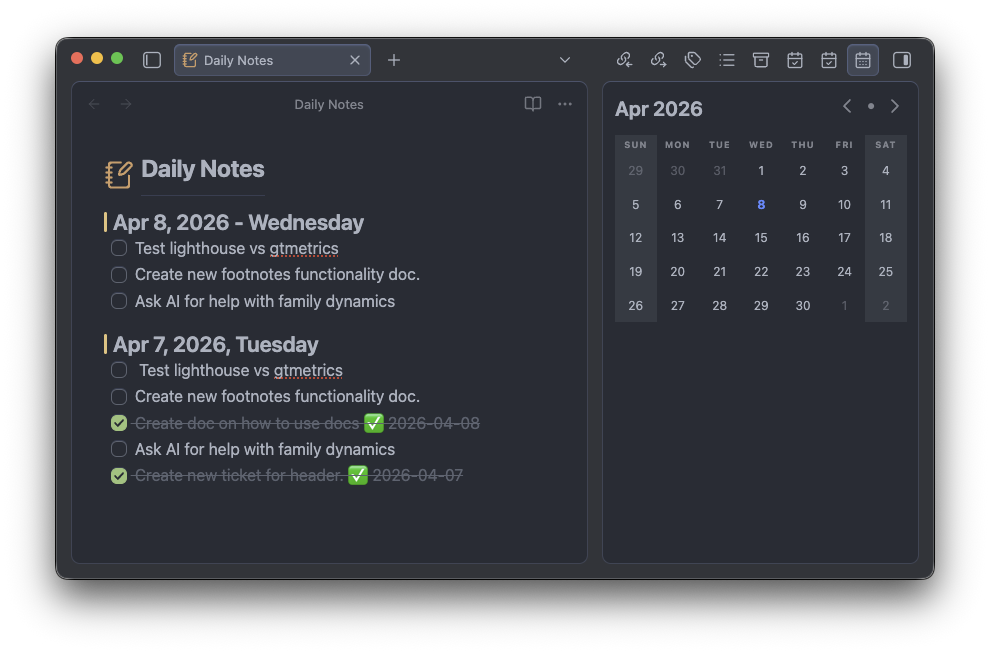

# Single File Daily Notes Enhanced

[](https://github.com/RickyRicardo17/obsidian-single-file-daily-notes-enhanced/releases/latest)

> This is a fork of **[Pranav Mangal](https://mang.al)**’s work on [Single File Daily Notes](https://github.com/pranavmangal/obsidian-single-file-daily-notes) starting at **v1.4.1**

An [Obsidian](https://obsidian.md) plugin for creating and managing daily notes in a single file, with extra options on top of the original.



## Enhancements

-  **Checkbox-style default entries** — In settings, turn on **Use checkboxes for default entries** so each bullet line in your default entry is written as a Markdown task (`- [ ] …`) when a new daily section is created. Lines that are already tasks are left as-is.
-  **Rollover incomplete tasks** — Optional **Rollover previous day's unchecked tasks**: pulls `- [ ]` / `* [ ]` lines from the nearest daily section in the file (prefer the day before; otherwise the next existing day), then your default entry. Checked and non-task lines stay put.

## Features

### Create and manage daily notes

The plugin will create a new note for today automatically and select the dummy entry for immediate editing. If today's note already exists, it will try to position the cursor for appending/editing the existing note.


The result is a single standard Markdown file:

```md
#### 02-01-2024, Tuesday

-   entry

#### 01-01-2024, Monday

-   Started planning for Q1 goals
-   Cleaned up the store room, needed to make space for the new suitcase
-   Read a few more chapters of [[The Dark Forest]]
```

### Use a calendar view

This plugin has a built-in calendar view that is displayed in the sidebar. This can be used to quickly jump to the daily note for a chosen date, and create one if it does not exist.

This calendar view can be shown/hidden using the command palette (`⌘ + P`).

Calendar View

### See an outline view

Since daily notes are formed by using standard Markdown headings, Obsidian's built-in outline view can be used to browse through them.

Outline View

### Configurability

You are able to configure:

- The name for the daily notes file
- The location of file
- The type of headings used for daily notes
- The date format used for daily notes
-  Optional checkboxes (task list syntax) for default new entries
-  Optional **rollover** of unchecked tasks from the previous date

## Installation

Install manually by copying `main.js`, `manifest.json`, and `styles.css` into `.obsidian/plugins/single-file-daily-notes-enhanced/` in your vault (create the folder if needed), or use [BRAT](https://github.com/TfTHacker/obsidian42-brat) pointed at this repository.

## Usage

- Disable Obsidian's built-in core daily notes plugin from settings.
  - This plugin does not yet interact with notes created by the core plugin, or any other community plugins designed to work with it.
  - While keeping it enabled will not affect either plugin, it may cause confusion.
- Open this plugin's settings to configure it to your preferences
- Click on the ribbon icon or select "Open daily notes" via the command palette (`⌘ + P`) to create the daily notes file.
- Once created, the file can be opened like a regular file, via the ribbon icon or the command palette.
- Start editing!

## Why

The in-built daily notes system in Obsidian is pretty decent, however it works by creating a separate file for each note. There are plugins to better manage these notes and display them in different views, but they still don't change the underlying file structure.

I didn't want hundreds of files in my vault dedicated to these daily notes, especially when they were quite small individually, which is why I created this plugin.

If you prefer writing longer and detailed daily notes, and wish to use the rest of Obsidian's plugin ecosystem that extends the built-in plugin, then this plugin might not be the best option for you.